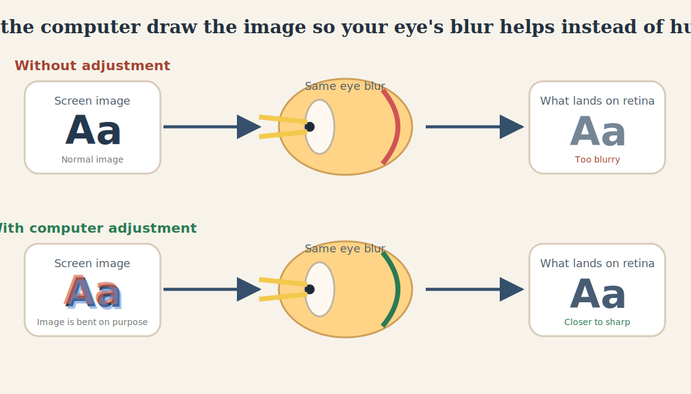
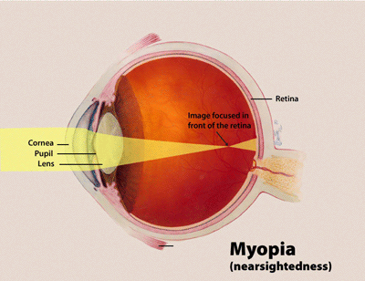
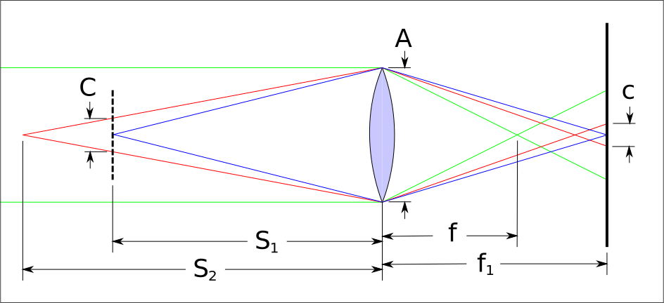

# Optical Adjust

This repo was spun out of a simple idea:

> What if I could use my computer at night without my glasses?

The basic idea is to have the computer draw the image a little "wrong" on purpose so that, after my eye blurs it, the image that lands on my retina ends up closer to "right."

That is what this repo is trying to test.

At night this can matter more because bigger pupils usually make defocus blur worse, which is one reason pupil size is part of the model.

To be precise, the problem here is usually not a "faulty retina." The retina is just where the image lands. The real problem is that the eye's optics focus the light in the wrong way, so the image is blurred before it reaches the retina.

In normal life, glasses fix the eye. This project asks whether software can sometimes help by changing the screen instead. It is deliberately narrow: a playground for testing that idea honestly and measuring when it helps, when it fails, and when it creates ugly artifacts.

## Status / WIP

This repo is open source, but the project is still a work in progress.

- The website is an experimental optics playground, not a finished product.
- The current model is incomplete and not validated for real-world use.
- Do not treat it as accessibility software, medical software, or vision-care guidance.
- The goal is to answer the optics question honestly, including the possibility that the current approach is not useful enough.

## The Idea In One Picture

<p align="center">
  
</p>

- Top row: a normal screen image goes through an out-of-focus eye and lands on the retina blurrier than you wanted.
- Bottom row: the computer pre-adjusts the image on purpose, so the same eye blur can pull it back toward something clearer.

## What The Codebase Does

The repo has five main jobs:

1. Turn a viewing state into an estimated residual defocus value.
2. Convert that residual defocus into a blur disk radius in display pixels.
3. Build a circular pillbox PSF and its corresponding disk OTF.
4. Compare two correction paths:
   - regularized Wiener prefiltering
   - unsharp-mask baseline
5. Render a browser playground that shows the target, the corrected image, the simulated retinal blur, and the relevant diagnostics.

In practical terms, the website answers: "Given this prescription, viewing distance, pupil size, and focus assumption, what blur does the screen induce, and does a prefiltered image survive that blur better than a simpler sharpened baseline?"

## Current Status

This repo is in the "prove the optics honestly" stage described in [docs/phase_0_3_build_spec.md](docs/phase_0_3_build_spec.md).

What is implemented now:

- residual-defocus math
- five focus modes
- spherical pillbox PSF
- analytic disk OTF using `J1`
- FFT-based Wiener deconvolution with regularization and gain capping
- unsharp-mask comparison path
- browser UI with diagnostics, warnings, and synthetic comparison panels
- objective comparison-matrix audit over four synthetic targets and three blur radii
- local browser-state persistence so reloads preserve the current manual experiment
- unit and browser tests for the math and render path

What is not implemented yet:

- directional astigmatic PSFs
- automatic calibration
- webcam or sensor-driven focus estimation
- browser-extension delivery as a validated equivalent renderer
- evidence that Wiener already beats the baseline in the intended real-world regime

## Visual Intuition

These online reference visuals are the intuition behind the picture above.

<p align="center">
  
  
</p>

- The myopia diagram shows the plain-English problem: the light is coming to focus in the wrong place, so the retina gets a blurrier image.
- The circle-of-confusion diagram shows why that happens: a point on the screen turns into a little blur disk instead of staying a point.

Source and license details for the imported images live in [apps/website/public/readme-assets/ATTRIBUTION.md](apps/website/public/readme-assets/ATTRIBUTION.md).

## Theory

The project is built around residual defocus, not raw prescription.

The forward model is:

```math
D_{display} = \frac{1}{z}
```

```math
D_{res} = |D_{display} - D_{focus}|
```

```math
\beta_{rad} \approx p \cdot |D_{res}|
```

```math
b_{px} \approx \frac{z \cdot p \cdot |D_{res}|}{0.0254 / PPI}
```

```math
R_{px} = \frac{b_{px}}{2}
```

Where:

- `z` is viewing distance in meters
- `p` is entrance pupil diameter in meters
- `D_display` is the display vergence demand in diopters
- `D_focus` is the vergence where the eye is assumed to be focused
- `D_res` is the residual defocus magnitude
- `b_px` is the blur-disk diameter in display pixels
- `R_px` is the blur-disk radius in display pixels

For the current spherical model, the PSF is a normalized circular pillbox. Its analytic OTF is:

```math
H(\rho) = \frac{2 J_1(2 \pi R \rho)}{2 \pi R \rho}
```

That OTF has real zero crossings, which is why naive inversion is unstable. The first zero is approximated by:

```math
\rho_0 \approx \frac{0.610}{R}
```

The correction path therefore uses Wiener-style regularization:

```math
G(\omega) = \frac{H^*(\omega)}{|H(\omega)|^2 + K}
```

The implementation also supports an explicit `maxGain` cap so the inverse filter cannot explode near OTF zeros.

For astigmatism, the repo preserves the spherocylindrical data model and includes the meridional power relation:

```math
F(\theta) = sph + cyl \cdot \sin^2(\theta - axis)
```

But that anisotropic path is not yet rendered in the live blur kernel.

As a diffraction sanity check, the repo also carries the Airy first-minimum relation:

```math
\theta_{Airy} \approx 1.22 \frac{\lambda}{D_{pupil}}
```

This is used as a boundary check, not as the main blur model.

## A Concrete Example

One of the repo's verified reference cases is:

- viewing distance `z = 0.5 m`
- pupil diameter `p = 4 mm = 0.004 m`
- residual defocus `D_res = 1 D`
- display density `254 PPI`

That gives:

- `D_display = 2 D`
- `beta_rad ≈ 0.004`
- blur diameter `b_px ≈ 20 px`
- blur radius `R_px ≈ 10 px`
- first disk-OTF zero `≈ 0.061 cycles/pixel`

Those values are asserted in [packages/optics/tests/equations.test.ts](packages/optics/tests/equations.test.ts).

## What The Visual Effect Is

The website renders a deterministic synthetic target and then runs three paths:

1. Original target.
2. Prefiltered target.
3. Simulated retinal blur after the target passes through the current blur kernel.

For each correction strategy, the playground shows both the prefiltered image and the blurred result that the viewer would approximately experience under the current model.

The six visible panels are:

- original target
- Wiener-prefiltered target
- unsharp-prefiltered target
- retinal blur of the original
- retinal blur of the Wiener result
- retinal blur of the unsharp result

The effect you are evaluating is not "does the corrected image look sharper on the display by itself?" The real question is whether the blurred-after-viewing result is better than the blurred original and better than the blurred unsharp baseline.

## Focus Modes

The focus modes are different assumptions about `D_focus`, not different blur formulas.

- `ScreenFocused`: assume accommodation lands on the display plane, so `D_focus = D_display`
- `RelaxedFarPoint`: derive focus from the relaxed far point implied by sphere power
- `FixedFocus`: use a manually supplied focus vergence
- `ManualResidual`: bypass focus inference and declare `D_res` directly
- `PrescriptionEstimate`: approximate the residual from sphere magnitude

The most honest control for exact experiments is usually `ManualResidual`. `PrescriptionEstimate` is intentionally approximate and should not be read as a validated accommodation model.

## Diagnostics And Warnings

The playground surfaces the quantities that matter for deciding whether inversion is plausible:

- `D_display`
- `D_focus`
- `D_res`
- blur diameter and blur radius
- first OTF zero
- clipping fraction
- overshoot fraction
- ringing energy
- max Wiener gain
- PSNR, RMSE, and SSIM for each retinal path

It also emits warning flags for:

- low-defocus regime
- zero-crossing risk
- large-radius regime
- calibration uncertainty
- astigmatism not rendered

These warnings are not cosmetic. They describe when the current model is weak, underdetermined, or likely to become numerically fragile.

## Repo Layout

- `apps/website`: browser playground shell
- `packages/optics`: core optics math, PSF/OTF logic, FFT, deconvolution, comparisons, synthetic targets
- `packages/optics-render`: canvas and browser rendering helpers
- `packages/optics-types`: shared public types
- `packages/optics-constants`: defaults, presets, UI text, thresholds, and source-doc indexing
- `docs`: concept, verification, build-spec, and validation-plan documents
- `tests/support`: shared comparison fixtures and golden metrics

## Key Docs

- [docs/optics_poc_concept.md](docs/optics_poc_concept.md): the narrow scientific question and modeling contract
- [docs/equation_source_verification_notes.md](docs/equation_source_verification_notes.md): provenance for the equations and modeling choices
- [docs/phase_0_3_build_spec.md](docs/phase_0_3_build_spec.md): scope boundaries, success criteria, and data contracts
- [docs/poc_e2e_validation_plan.md](docs/poc_e2e_validation_plan.md): what the test suite already proves and what it still does not prove
- [docs/vite-plus-notes.md](docs/vite-plus-notes.md): repo-specific Vite+ workflow constraints

If you want the shortest path to understanding the project, read them in that order.

## How To Use The Playground

Install dependencies first:

```bash
vp install
```

Start the website from the repo root:

```bash
vp run dev
```

Or run the app directly:

```bash
cd apps/website
vp dev
```

Then:

1. Pick a preset or start from the default.
2. Choose the focus mode.
3. Set sphere, distance, pupil size, and screen PPI.
4. If you want ground-truth experiments, switch to `ManualResidual` and set the residual directly.
5. Tune `Wiener K` and `Max Wiener gain`.
6. Compare the blurred Wiener panel against the blurred original and blurred unsharp panel.
7. Read the Outcome Audit panel. It reports the current target verdict and the shared 12-case matrix verdict with the active Wiener and unsharp settings.
8. Watch the diagnostics and warnings while tuning. A result that looks sharp but has high clipping, high overshoot, or severe zero-crossing risk is not a good result.

## Programmatic Use

The core optics path is available from the workspace packages:

```ts
import { calculateBlurResult, createPillboxKernel, compareCorrectionPaths } from "optics";
import { FocusMode } from "optics-types";

const blur = calculateBlurResult({
  focusMode: FocusMode.ManualResidual,
  manualResidualDiopters: 1,
  prescription: { sph: 0, cyl: 0, axis: 0 },
  pupilDiameterMm: 4,
  screenPpi: 254,
  viewingDistanceM: 0.5,
});

const kernel = createPillboxKernel(blur.blurRadiusPx);
const comparison = compareCorrectionPaths(imageGrid, kernel, {
  unsharpAmount: 1.5,
  wiener: {
    regularizationK: 0.03,
    maxGain: 8,
  },
});
```

The important distinction is:

- `wienerCorrected` is the prefiltered display image
- `wienerRetinal` is the simulated post-blur result

The second image is the one that matters for the POC claim.

## Commands

Safe repo-level commands:

```bash
vp check
vp test
bash scripts/test-all.sh
bash scripts/ready.sh
vp run build -r
```

Browser-mode suites should be run directly from their package directories:

```bash
cd packages/optics-render
vp test

cd apps/website
vp test
```

Do not run the browser suites through root `vp run` wrappers such as `vp run website#test` or `vp run optics-render#test`. This workspace documents those paths as unreliable.

## Validation Posture

The repo already has real validation infrastructure, but it is still a POC harness rather than proof of user benefit.

What the tests currently establish:

- the optics equations are stable and named explicitly
- the focus modes behave coherently
- the PSF/OTF math matches the expected spherical model
- the browser app renders deterministic outputs and diagnostics
- the comparison pipeline produces bounded artifacts and measurable quality metrics

What the repo is still trying to answer:

- whether Wiener materially beats unsharp mask in the intended regime
- whether the artifacts remain tolerable at useful settings
- whether the gains survive real reading tasks and human preference testing

At the current default settings, the shared synthetic matrix does not show a Wiener win over the unsharp baseline. The playground now reports that explicitly rather than leaving it implicit in the raw metrics.

That distinction is central to the project. The codebase is built to answer the question honestly, not to smuggle in the assumption that the answer is already yes.

## Modeling Boundaries

Current limitations that matter when interpreting results:

- the renderer is sphere-first
- nonzero cylinder triggers a warning because astigmatism is not yet rendered directionally
- `PrescriptionEstimate` is a convenience heuristic
- calibration output should be described as `D_eff` until validated, not as physiological ground-truth `D_res`
- extension-style browser delivery is explicitly out of scope for the current science gate

## Source Trail

The code is heavily annotated with first-party doc references and primary-source citations. The most important implementation entry points are:

- [packages/optics/src/equations.ts](packages/optics/src/equations.ts)
- [packages/optics/src/focus.ts](packages/optics/src/focus.ts)
- [packages/optics/src/psf.ts](packages/optics/src/psf.ts)
- [packages/optics/src/otf.ts](packages/optics/src/otf.ts)
- [packages/optics/src/deconvolution.ts](packages/optics/src/deconvolution.ts)
- [packages/optics/src/comparison.ts](packages/optics/src/comparison.ts)
- [apps/website/src/app-render.ts](apps/website/src/app-render.ts)

That path mirrors the full pipeline from viewing assumptions to displayed comparison panels.

## License

The code in this repository is available under the [MIT License](LICENSE).

Bundled third-party reference images keep their own attribution and license notes in [apps/website/public/readme-assets/ATTRIBUTION.md](apps/website/public/readme-assets/ATTRIBUTION.md).
